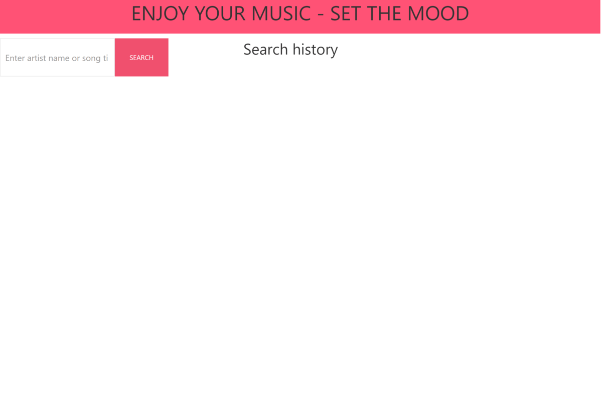

# Project_1_web_development

As a music enthusiast, I want to easily search for a song by title, artist, or even a snippet of lyrics, so that I can quickly find the information and lyrics I need to better understand and enjoy my favorite tracks. Using a music search engine that integrates with the MusiXMatch and Words APIs, I can easily search for a song and get detailed information about it, including album art and related information. Additionally, I can view a related picture that adds context and atmosphere to the music. This will help me broaden my musical horizons, discover new artists and songs, and have a richer music listening experience overall.

# Module 6 Challenge Weather Dashboard [Web Developer]

## Description

This repository contains The project 1 for the Web Developer bootcamp, which is a web application built with HTML, CSS, and JavaScript, utilizing a backend API to search for and retrieve lyrics. The frontend would consist of a responsive design that adjusts to various screen sizes, allowing users to easily access the search feature and view the lyrics on any device.

The API usage would be a crucial part of this application, allowing the backend to handle the heavy lifting of searching and retrieving lyrics while the frontend focuses on displaying them in a user-friendly manner. The API would need to be reliable and fast, returning accurate results for a wide range of songs.

Overall, this repo would provide a valuable tool for music lovers and aspiring singers alike, allowing them to easily search for and access lyrics to their favorite songs.

## Deployed application 

(https://Enrique-V06.github.io/P1_Lyrics_seach-COLAB/)

The following image shows the application first look and functionality. The functionallity.

## Usage
Users would be presented with a search bar where they can enter the name of a song they wish to find lyrics for. The user will be presented with a list of options to choose. The user would select thier prefered option and the backend API would be called to retrieve the corresponding lyrics.

The lyrics would be displayed on the page in a clean and organized manner, with each verse separated for easy reading. The user would be able to scroll through the lyrics and view them in their entirety.

## Installation

N/A

## Credits

This code is made as a colaborative project by 
    - Hector Enrique Vázquez (https://github.com/Enrique-V06)
    - Ernesto Cruz Rosales (https://github.com/neto1895)
    - Gerardo García (https://github.com/SalasGS94)

## License

N/A

